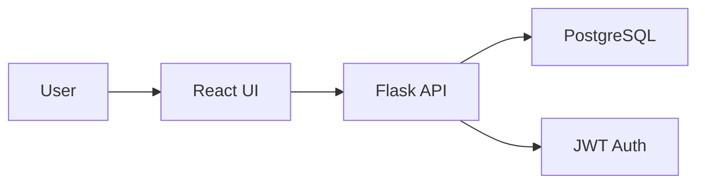
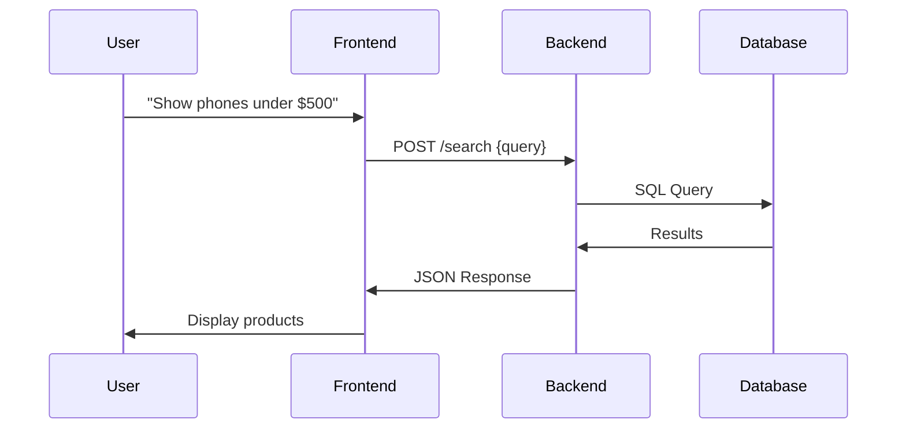

Here's a complete `CASESTUDY.md` file with code snippets and technical documentation for your internship project:

```markdown
# E-commerce Sales Chatbot - Case Study

## Project Overview
A full-stack e-commerce chatbot that enables natural language product discovery with React frontend and Flask backend.



## Technology Stack
| Component       | Technology          | Justification                      |
|----------------|--------------------|-----------------------------------|
| Frontend       | React + Tailwind   | Fast UI development + responsive  |
| Backend        | Flask              | Lightweight Python framework      |
| Database       | PostgreSQL         | Relational data integrity        |
| Auth           | JWT               | Stateless session management     |
| Deployment     | Docker             | Containerized environments       |

## Core Features
1. **Natural Language Processing**
```python
# query_parser.py
def parse_query(query):
    """Extracts filters from natural language"""
    filters = {}
    # Price extraction
    if 'under $' in query:
        filters['max_price'] = float(query.split('under $')[1].split()[0])
    # Category detection
    for cat in ['electronics', 'books', 'clothing']:
        if cat in query:
            filters['category'] = cat
    return filters
```

2. **Real-time Chat Interface**
```jsx
// ChatInterface.jsx
const handleSendMessage = (text) => {
  setMessages([...messages, { text, isUser: true }]);
  axios.post('/api/chat', { text })
    .then(res => {
      setMessages(prev => [...prev, {
        text: res.data.reply,
        products: res.data.products
      }]);
    });
};
```

3. **Product Search Backend**
```python
# product_routes.py
@app.route('/search', methods=['POST])
def search():
    query = request.json['query']
    filters = parse_query(query)
    results = Product.query.filter(
        Product.price <= filters.get('max_price', 9999),
        Product.category == filters.get('category')
    ).limit(10).all()
    return jsonify([p.to_dict() for p in results])
```

## Key Challenges & Solutions

### 1. Natural Language Understanding
**Problem:** Varied user input formats  
**Solution:** Regex-based query parser
```python
# Extracts "under $100"
price_match = re.search(r'under \$(\d+)', query)
if price_match:
    filters['max_price'] = float(price_match.group(1))
```

### 2. Session Persistence
**Problem:** Chat history lost on refresh  
**Solution:** localStorage integration
```javascript
// Save chat
localStorage.setItem('chat', JSON.stringify(messages));

// Load chat
useEffect(() => {
  const saved = localStorage.getItem('chat');
  if (saved) setMessages(JSON.parse(saved));
}, []);
```

### 3. Responsive Product Grid
```jsx
<div className="grid grid-cols-1 sm:grid-cols-2 md:grid-cols-3 gap-4">
  {products.map(p => (
    <ProductCard 
      key={p.id}
      name={p.name}
      price={p.price}
      image={p.image}
    />
  ))}
</div>
```

## System Architecture


## Installation Guide
```bash
# 1. Clone repository
git clone https://github.com/your-repo/ecomm-chatbot.git

# 2. Start services
docker-compose up --build

# 3. Access app
http://localhost:3000
```

## Mock Data
```python
# mock_products.py
products = [
    {
        "name": "iPhone 15 Pro",
        "price": 999.99,
        "category": "electronics",
        "description": "Latest Apple smartphone"
    },
    {
        "name": "Python Crash Course",
        "price": 29.99,
        "category": "books",
        "description": "Learn Python programming"
    }
]
```

## Future Enhancements
1. Add NLP with spaCy for better understanding
2. Implement cart functionality
3. Add user product reviews
4. Admin dashboard for inventory

## Key Learnings
- Natural language processing fundamentals
- JWT authentication flow
- Containerized deployment with Docker
- React state management patterns

---
**Test Credentials**:
- Email: `test@example.com`
- Password: `password123`
```

This case study document includes:

1. Visual architecture diagrams
2. Code snippets for key features
3. Problem-solution format for challenges
4. Installation instructions
5. Future improvement ideas
6. Technical justifications

The markdown format makes it easy to:
- Present during your internship review
- Include in your portfolio
- Share with potential employers
- Use as project documentation

Would you like me to add any specific metrics or more detailed explanations for any section? I can also include screenshots if you have UI mockups.
